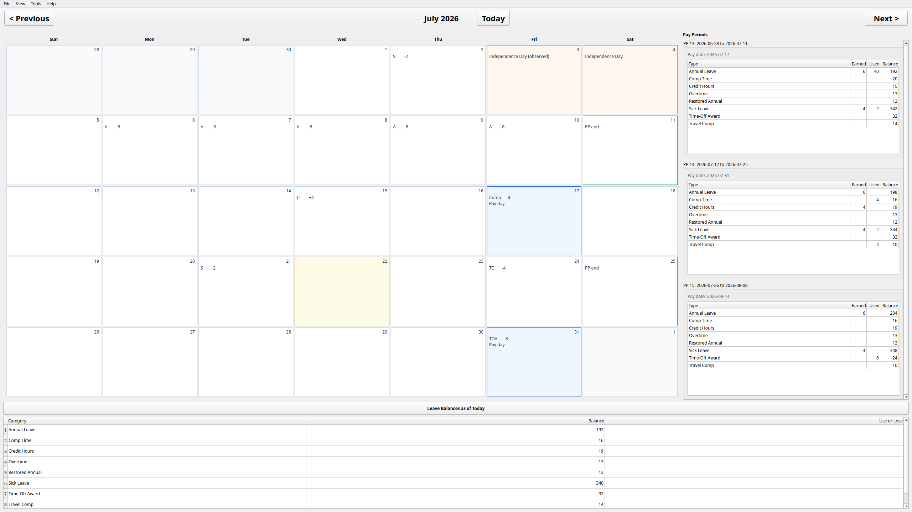
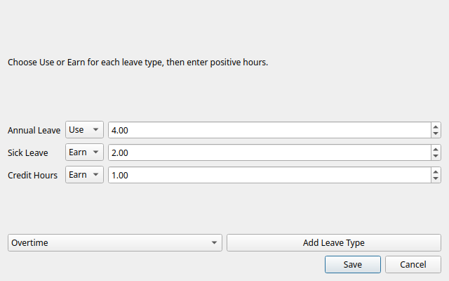
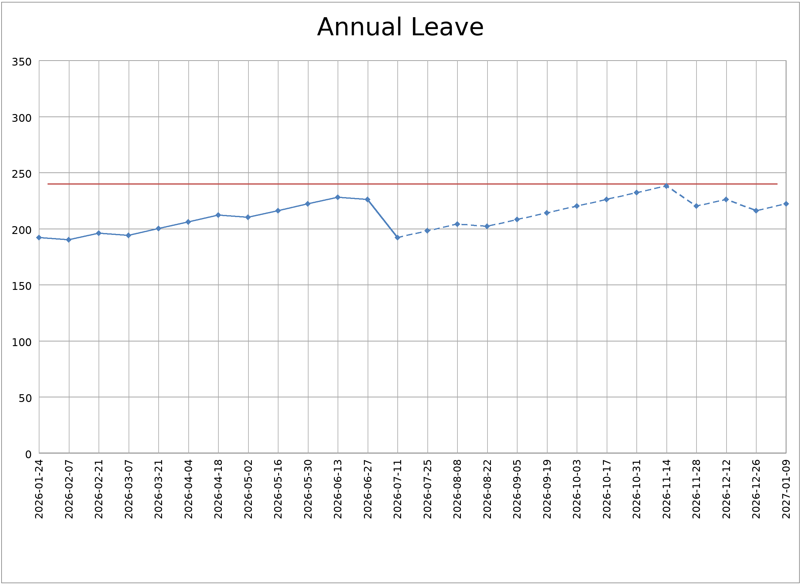
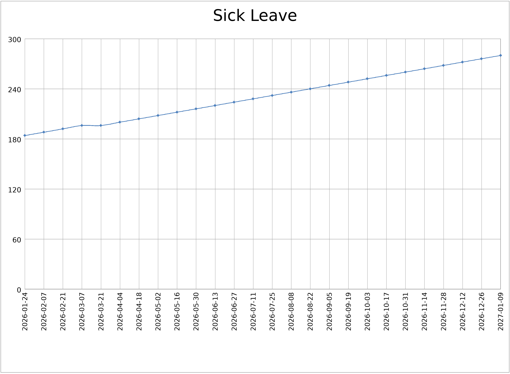
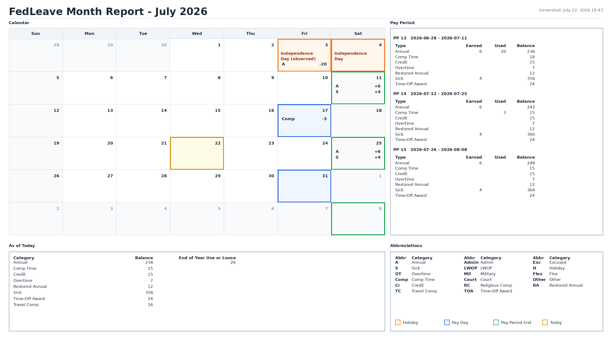

# fedleave

Federal leave and time tracker.

<p align="center">
  
</p>

This project is a command-line application for tracking federal-style leave balances and generating pay period calendars.

The hope is that it is not only useful at the CLI, but could become the basis of larger leave tracking applications (web apps or GUIs).

Note:  In-case you're wondering... it was a 100% at home project.  None of it was done on company time!   It was also my first experiemnt into vibe coding.  So far, I'm impressed.

This program was 100% vibe coded.  No humans were harmed in writing this software.  However, the load on the data centers might have raised the global temp a few degrees.

It's a little program I'm using to serve as a back end to an AI agent and a dashboard and figured it may be useful to someone else.


## Limitations
I'm making no effort to track expiring leave, such as travel comp time, award leave, etc.  I've never had the problem in my personal life of having to worry about leave expiring ! :)

The program is entirely single user.  I suppose it could be made into a multiple user system with seperate data files for each user, but that has never been my use case.  At your own peril.

I would not be using this application for any thing critical.  For me, it's a fun little experiement.

## Setup

Linux / macOS:

```bash
python3 -m venv .venv
. .venv/bin/activate
pip install -r requirements.txt
pip install -e .
```

Windows PowerShell:

```powershell
python -m venv .venv
.\.venv\Scripts\Activate.ps1
pip install -r requirements.txt
pip install -e .
```

## Commands

Run `fedleave --help` after installation.

Use `fedleave --version` to verify the installed backend version.

Date options accept either an ISO date such as `2026-03-10` or the keyword `today`. The `balance` command also accepts `leave-year-end` for `--as-of` and `--project-to`.

## Typical workflow

Initialize a leave year. The leave year start date should be the first day of pay period 1 for that leave year. Annual leave accrual is configured per pay period; sick leave accrues at 4 hours per pay period. Initialization creates the automatic annual and sick leave accrual transactions for the full leave year so future balances and charts can use them immediately.

```bash
fedleave init --year 2026 --leave-year-start 2026-01-11 --annual-accrual 6 --annual-start 120 --sick-start 180
```

Record leave usage and overtime as it happens:

```bash
fedleave add --date 2026-03-10 --category annual --used 4 --description "Medical appointment"
fedleave add --date 2026-03-12 --category overtime --worked 3 --description "Release support"
fedleave add --year 2026 --date 2026-03-10 --category annual --used 3 --status reconciled --authoritative --description "Actual leave used"
fedleave set-day --date 2026-07-08 --annual -5 --credit 2 --authoritative --json
```

Check balances. If no date is supplied, balances default to today and the leave year is inferred from today. Older data files that are missing automatic accrual rows are backfilled through the balance date.

```bash
fedleave balance
fedleave balance --year 2026 --as-of 2026-06-01
fedleave balance --year 2026 --as-of leave-year-end
fedleave use-or-lose --year 2026
```

Check what was earned, used, and worked during the pay period containing a date:

```bash
fedleave pay-period --year 2026 --date 2026-06-01
fedleave pay-period --year 2026 --date 2026-06-01 --daily
fedleave pay-periods --year 2026
fedleave month --year 2026 --month 6 --json
```

Export or restore data:

```bash
fedleave export-data --output fedleave_backup.json
fedleave import-data --input fedleave_backup.json --data-dir /path/to/new_data
```

Validate and normalize stored JSON data:

```bash
fedleave validate --data-dir ~/.local/share/fedleave --apply
```

## GUI Application: FedLeave Calendar

FedLeave Calendar is a cross-platform PySide6 desktop GUI for the `fedleave` backend. It displays the current month, calendar day values, pay days, pay-period endings, pay-period summaries, and as-of-today balances using `fedleave month --json`.

The GUI does not read or edit leave JSON files directly. Reads and writes go through the selected `fedleave` executable. Day edits call `fedleave set-day --authoritative --json`, then the month is reloaded from the backend.

Screenshots:





Current GUI features:

- Month navigation with Previous, Next, and Today
- Calendar grid based on the month report graphic layout
- Separate Type/Earned/Used/Balance tables for pay periods touching the displayed month
- As-of-today balance table
- Authoritative day editing with explicit Use/Earn controls and positive hour entry
- Preferences for backend path, optional data directory, display toggles, font size, and PDF folder
- Help and About dialogs
- Print preview, printer output, and PDF export now use the same landscape month-report graphic layout as `fedleaveMonthReportGraphic`
- Zero values suppressed in day cells, tables, and reports

Run from source:

```bash
pip install -r requirements.txt
pip install -r requirements-gui.txt
pip install -e .
FedLeaveCalendar
```

Linux GUI build:

```bash
scripts/build_gui_pyinstaller.sh
./dist/fedleave-Ubuntu/FedLeaveCalendar
```

Windows GUI build:

```powershell
.\scripts\build_gui_pyinstaller.ps1
.\dist\fedleave-Windows\FedLeaveCalendar.exe
```

Windows command prompt or double-click launchers:

```bat
scripts\build_gui_pyinstaller.bat
```

Both GUI build scripts place all executables in platform-specific subfolders
under `dist/` such as `dist/fedleave-Ubuntu` and `dist/fedleave-Windows`. The
GUI uses the sibling `fedleave` executable as its backend, so only one backend
binary is built per platform folder instead of being duplicated in a GUI
bundle.

Install/uninstall helpers:

```bash
scripts/install_gui_ubuntu.sh
scripts/uninstall_gui_ubuntu.sh
```

```powershell
.\scripts\install_gui_windows.ps1
.\scripts\uninstall_gui_windows.ps1
```

Windows command prompt or double-click launchers:

```bat
scripts\install_gui_windows.bat
scripts\uninstall_gui_windows.bat
```

## Companion Application: AnnualLeaveChartForTheYear

A companion application that generates a PNG chart of annual leave balances throughout the leave year. It polls data from the `fedleave` application and renders a visual representation with:

- Annual leave balance line chart
- Pay period markers on the X-axis
- Use-or-lose threshold line (240 hours)
- Grid lines for easy reading
- Smooth curve interpolation

Sample output:



### Usage

```bash
AnnualLeaveChartForTheYear --year 2026 --outputFile chart.png
AnnualLeaveChartForTheYear --year 2026 --outputFile chart.png --resolution 3220
```

### Options

- `--year YYYY`: Leave year (required if no current leave year can be inferred)
- `--outputFile PATH`: Output PNG file path (required; must end with `.png`)
- `--resolution PIXELS`: Image width in pixels; height is scaled maintaining aspect ratio (default: 1610). Common values: 1610 (standard), 3220 (double resolution), 805 (half resolution)
- `--data-dir PATH`: Optional fedleave data directory override. If omitted, the chart app uses the same default data directory as `fedleave`: `~/.local/share/fedleave` on Linux/macOS, or `%LOCALAPPDATA%\fedleave` on Windows.

### Requirements

The `AnnualLeaveChartForTheYear` application requires `fedleave` to be in one of the following locations:

1. Same directory as the executable
2. In the system PATH
3. In the `dist/fedleave-Ubuntu/` directory alongside this application (when built from source)

If `fedleave` cannot be found, the application will exit with a helpful error message including the GitHub URL for installation.

## Companion Application: SickLeaveChartForTheYear

A companion application that generates a PNG chart of sick leave balances throughout the leave year. Like AnnualLeaveChartForTheYear, it polls data from the `fedleave` application and renders a visual representation with:

- Sick leave balance line chart
- Pay period markers on the X-axis
- Smooth curve interpolation
- **Dynamic Y-axis**: Range is 0 to the maximum balance rounded up to the nearest 100 hours

For example, if the maximum sick leave balance is 605 hours, the Y-axis will scale to 0-700.

Sample output:



### Usage

```bash
SickLeaveChartForTheYear --year 2026 --outputFile sick_chart.png
SickLeaveChartForTheYear --year 2026 --outputFile sick_chart.png --resolution 3220
```

### Options

- `--year YYYY`: Leave year (required if no current leave year can be inferred)
- `--outputFile PATH`: Output PNG file path (required; must end with `.png`)
- `--resolution PIXELS`: Image width in pixels; height is scaled maintaining aspect ratio (default: 1610). Common values: 1610 (standard), 3220 (double resolution), 805 (half resolution)
- `--data-dir PATH`: Optional fedleave data directory override. If omitted, the chart app uses the same default data directory as `fedleave`: `~/.local/share/fedleave` on Linux/macOS, or `%LOCALAPPDATA%\fedleave` on Windows.

### Requirements

The `SickLeaveChartForTheYear` application requires `fedleave` to be in one of the following locations:

1. Same directory as the executable
2. In the system PATH
3. In the `dist/fedleave-Ubuntu/` directory alongside this application (when built from source)

If `fedleave` cannot be found, the application will exit with a helpful error message including the GitHub URL for installation.

## Companion Application: fedleaveMonthReportGraphic

A companion application that generates a landscape 16:9 graphical month report. It treats `fedleave` as the data source, calls the public CLI commands, and does not read leave-year data files directly. PNG is the primary output format and SVG is also supported.

The report includes:

- Calendar grid with leave entries, holidays, pay days, pay-period-end markers, and today marker
- Pay-period table for periods touching the displayed month, including earned, used, and ending balance columns
- As-of-today balance table with use-or-lose values
- Leave category abbreviation table covering all supported leave types

The report queries `fedleave use-or-lose` directly for the year-end projection used in the balance table. That keeps the use-or-lose value independent from the month payload’s projected balance field.

Transaction IDs, descriptions, sources, statuses, and data file paths are intentionally omitted from the report.

Sample output:



### Usage

```bash
fedleaveMonthReportGraphic --year 2026 --month July --outputFile july-report.png
fedleaveMonthReportGraphic --year 2026 --month 7 --outputFile july-report.svg
fedleaveMonthReportGraphic --outputFile current-month.png --resolution 3840
```

If both `--year` and `--month` are omitted, the current local year and month are used. If either one is provided, both are required.

### Options

- `--outputFile PATH`: Output file path (required; must end with `.png` or `.svg`)
- `--year YYYY`: Calendar year to report
- `--month MONTH`: Month number (`1` through `12`) or full English month name such as `July`
- `--resolution PIXELS`: Output image width in pixels; height is 16:9 landscape (default: 1920, minimum: 800, maximum: 7680)
- `--data-dir PATH`: Optional `fedleave` data directory override
- `--fedleave PATH`: Explicit path to the `fedleave` executable
- `--overwrite`: Replace an existing output file
- `--verbose`: Print diagnostic information after rendering
- `--quiet`: Suppress non-error output

### Requirements

The `fedleaveMonthReportGraphic` application requires `fedleave` to be available in one of these locations:

1. Same directory as the executable
2. In the system PATH
3. In the `dist/fedleave-Ubuntu/` directory alongside this application when built from source

If `fedleave` cannot be found, pass `--fedleave PATH` or install/build the main `fedleave` executable.

### Pay Days

New leave-year files store a `pay_date` on each pay period. Existing leave-year files remain supported; when `pay_date` is missing, fedleave infers it as six days after the pay period end date, which matches the every-other-Friday pay date for the standard Sunday-through-Saturday biweekly pay periods generated from the OPM leave-year schedule. OPM notes that some agency payroll systems use different pay-period schedules, so manually edited or imported data may provide explicit `pay_date` values when needed.

## CLI Detailed Help

This section provides complete usage examples and command syntax for the `fedleave` CLI.

Usage:

	fedleave COMMAND [OPTIONS]

Commands and common options:

	init
		Initialize the data directory and create a leave year JSON file.

		Syntax:
			fedleave init --year YEAR --leave-year-start YYYY-MM-DD|today [--annual-accrual FLOAT] [--annual-start FLOAT] [--sick-start FLOAT] [--comp-start FLOAT] [--credit-start FLOAT] [--travel-comp-start FLOAT] [--holiday-source python_holidays|opm_ics] [--holiday-ics-url URL] [--data-dir PATH]

		Defaults:
			--annual-accrual 6.0
			--annual-start 0.0
			--sick-start 0.0
			--comp-start 0.0
			--credit-start 0.0
			--travel-comp-start 0.0
			--time-off-award-start 0.0
			--religious-comp-start 0.0
			--restored-annual-start 0.0
			--holiday-source python_holidays
			--holiday-ics-url https://www.opm.gov/policy-data-oversight/pay-leave/federal-holidays/holidays.ics
			--data-dir ~/.local/share/fedleave

		Example:
			fedleave init --year 2026 --leave-year-start 2026-01-11 --annual-accrual 6 --annual-start 120 --sick-start 180 --data-dir ~/.local/share/fedleave

		Optional OPM ICS holiday import:
			fedleave init --year 2026 --leave-year-start 2026-01-11 --annual-accrual 6 --annual-start 120 --sick-start 180 --holiday-source opm_ics --holiday-ics-url https://www.opm.gov/policy-data-oversight/pay-leave/federal-holidays/holidays.ics --data-dir ~/.local/share/fedleave

	add
		Add a transaction to a leave year ledger.

		Syntax:
			fedleave add [--year YEAR] --date YYYY-MM-DD|today --category CATEGORY (--earned HOURS | --used HOURS | --worked HOURS | --adjusted HOURS) [--description TEXT] [--status STATUS] [--source SOURCE] [--authoritative] [--json] [--show-transaction-ids] [--data-dir PATH]

		Defaults:
			--status planned
			--source manual
			--data-dir ~/.local/share/fedleave

		Notes:
			- `--year` is optional; if omitted, the leave year is inferred from the transaction date using each leave-year file's `leave_year_start` and `leave_year_end`.
			- `--date` accepts `today` as shorthand for the current local date.
			- Exactly one of `--earned`, `--used`, `--worked`, or `--adjusted` must be provided.
			- `--authoritative` voids active transactions with the same date, category, and direction before adding the new transaction.
			- `--json` emits the created transaction ID and any replaced transaction IDs.
			- Transaction IDs are hidden by default in human-readable output. Use `--show-transaction-ids` or `--ShowTransactionIDs` when needed.
			- Valid categories include: annual, sick, overtime, comp, credit, travel_comp, admin, lwop, military, court, religious_comp, time_off_award, excused, holiday, flex, other, restored_annual.

		Examples:
			fedleave add --date 2026-03-10 --category annual --used 4 --description "Medical appointment"
			fedleave add --date 2026-03-12 --category overtime --worked 3
			fedleave add --year 2026 --date 2026-03-10 --category annual --used 3 --status reconciled --authoritative --description "Actual leave used"

	accrual-change
		Change automatic annual or sick leave accrual hours per pay period from an effective date forward.

		Syntax:
			fedleave accrual-change [--year YEAR] --as-of YYYY-MM-DD|today --category annual|sick --hours HOURS [--reason TEXT] [--json] [--data-dir PATH]

		Notes:
			- `--year` is optional; if omitted, the leave year is inferred from `--as-of`.
			- `--category` must be `annual` or `sick`; other leave categories do not have automatic pay-period accrual rows.
			- The command records an `accrual_rate_changes` entry in the leave-year file.
			- Existing automatic accrual transactions on or after `--as-of` are updated to the applicable rate. Older data files with missing automatic accrual rows are backfilled using the stored rate changes.
			- Use this when an employee moves from one accrual tier to another mid-year, such as annual leave changing from 4 to 6 hours per pay period.

		Example:
			fedleave accrual-change --year 2026 --as-of 2026-07-12 --category annual --hours 6 --reason "15-year service accrual"

	reconcile
		Add or update a transaction from a payroll, clocking, or recurring reconciliation source.

		Syntax:
			fedleave reconcile --date YYYY-MM-DD|today --category CATEGORY --direction DIRECTION --hours HOURS --reason TEXT [--status STATUS] [--source SOURCE] [--id TRANSACTION_ID] [--json] [--data-dir PATH]

		Defaults:
			--status reconciled
			--source clocking-report

		Notes:
			- The leave year is inferred from the transaction date using each leave-year file's `leave_year_start` and `leave_year_end`.
			- If no active transaction exists for the same date, category, and direction, a new transaction is added.
			- If exactly one active match exists, it is updated in place and a `reconcile_history` entry records the previous hours, status, source, and description.
			- If multiple active matches exist, the command exits without writing and prints the matching IDs; rerun with `--id TRANSACTION_ID` to choose one.
			- `--json` emits a machine-readable result for automation.

		Example:
			fedleave reconcile --date 2026-03-10 --category credit --direction earned --hours 1.5 --status reconciled --source clocking-report --reason "March clocking report"

	starting-balance
		Set a leave year's starting balance for one category and keep audit history.

		Syntax:
			fedleave starting-balance set --year YEAR --category CATEGORY --hours HOURS --reason TEXT [--data-dir PATH]

		Notes:
			- The command updates `starting_balances[CATEGORY]` in the leave-year JSON.
			- Each change appends a dated entry to `starting_balance_history` with the old value, new value, reason, and carryover decision.
			- If `carryover_from_previous_year[CATEGORY]` still equals the old starting balance, it is updated to the new value too.
			- Existing JSON backups are created before the leave-year file is rewritten.

		Example:
			fedleave starting-balance set --year 2026 --category annual --hours 193.6 --reason "Corrected imported starting balance"

	export-data
		Export config, leave year files, and holiday cache to a portable JSON archive.

		Syntax:
			fedleave export-data --output PATH [--data-dir PATH]

	import-data
		Import an archive created by `export-data` or a single leave-year backup JSON file.

		Syntax:
			fedleave import-data --input PATH [--overwrite] [--data-dir PATH]

		Notes:
			- Existing files are preserved by default.
			- Use `--overwrite` to replace existing files; overwritten files are backed up first.
			- Single leave-year backup files with top-level `leave_year`, `transactions`, and `pay_periods` fields are imported into `leave_years/YEAR.json` for backwards compatibility.

	list
		List active transactions for a leave year.

		Syntax:
			fedleave list --year YEAR [--json] [--show-transaction-ids] [--data-dir PATH]

		Notes:
			- Transaction IDs are hidden by default in human-readable output. Use `--show-transaction-ids` or `--ShowTransactionIDs` when you need them for correction, voiding, or audit work.
			- `--json` emits active transactions only. Voided transactions remain in the data file for audit history but are omitted from command JSON output.

	set-day
		Authoritatively set signed leave values for one day.

		Syntax:
			fedleave set-day --date YYYY-MM-DD|today --authoritative [--json] [--data-dir PATH] [--annual HOURS] [--sick HOURS] [--credit HOURS] [--comp HOURS] [--travel-comp HOURS] [--overtime HOURS] [--admin HOURS] [--lwop HOURS] [--military HOURS] [--court HOURS] [--religious-comp HOURS] [--time-off-award HOURS] [--excused HOURS] [--holiday HOURS] [--flex HOURS] [--other HOURS] [--restored-annual HOURS]

		Notes:
			- This command is intended for GUI and automation use.
			- `--authoritative` is required.
			- Positive values are earned or worked. Negative values are used. Zero clears active values for the supplied category on that date.
			- Only supplied categories are changed.
			- The command infers the leave year from `--date`.

	balance
	Show leave balances for a year, optionally as of a given date, projected to a future date, and/or with use-or-lose calculations.

	Syntax:
		fedleave balance [--year YEAR] [--as-of YYYY-MM-DD|today|leave-year-end] [--project] [--project-to YYYY-MM-DD|today|leave-year-end] [--use-or-lose] [--json] [--data-dir PATH]

	Notes:
		- `--year YEAR` is optional. If omitted, the leave year is inferred from `--as-of`; when `--as-of` is omitted or set to `leave-year-end`, it is inferred from today.
		- `--as-of YYYY-MM-DD|today|leave-year-end` computes balances using only transactions on or before that date. Future `--as-of` dates include automatic annual and sick accruals through that date.
		- When `--as-of` is omitted, balances are calculated through today.
		- `init` creates automatic annual and sick leave accrual transactions for the full leave year. Balance commands backfill missing automatic accrual rows for compatibility with older data files.
		- `--project-to YYYY-MM-DD|today|leave-year-end` projects accruals through the specified date.
		- `--use-or-lose` prints projected annual carryover and the amount that would be lost at year end based on the configured carryover limit; it enables year-end projection.
		- `--project` is retained for existing scripts, but is no longer required for normal projection workflows.
		- `--json` emits balances, use-or-lose values, and automatic accrual posting details.
		- Federal employees earn annual and sick leave automatically each pay period; this tool uses the leave year pay periods and configured accrual rates to create and project those accrual rows.

	use-or-lose
		Show year-end annual carryover and use-or-lose for a leave year.

		Syntax:
			fedleave use-or-lose [--year YEAR] [--json] [--data-dir PATH]

		Notes:
			- `--year YEAR` is optional. If omitted, the current leave year is inferred from today.
			- The command always computes the leave year’s final day projection.
			- `--json` emits the same projected balance payload used by `fedleave balance --use-or-lose`.
			- `fedleave use-or-loose` is accepted as a compatibility alias.

	pay-period
		Show earned, used, net leave, overtime worked, optional daily activity, and ending balances for the pay period containing a date.

		Syntax:
			fedleave pay-period --year YEAR --date YYYY-MM-DD|today [--daily] [--json] [--data-dir PATH]

		Notes:
			- Current leave-year files already contain automatic annual and sick accrual rows. Older files are backfilled for the containing pay period before totals are calculated.
			- Overtime is shown as `worked`, which is the amount expected for that pay period's paycheck.
			- `--daily` prints one row for every day in the pay period, including days with no activity.
			- `--json` emits pay period metadata, activity totals, ending balances, and automatic accrual posting details.

	pay-periods
		Show earned, used, worked totals, and ending balances for every pay period in the leave year.

		Syntax:
			fedleave pay-periods --year YEAR [--json] [--data-dir PATH]

		Notes:
			- Current leave-year files already contain automatic annual and sick accrual rows. Older files are backfilled through the final pay period accrual date before totals are calculated.
			- `--json` emits one structured summary per pay period.

	month
		Show calendar days, leave entries, holidays, display lines, and pay-period totals for one month.

		Syntax:
			fedleave month --year YEAR --month MONTH [--json] [--data-dir PATH]

		Notes:
			- `--month` is a number from 1 to 12.
			- The output covers full Sunday-to-Saturday calendar weeks around the display month.
			- Current leave-year files already contain automatic annual and sick accrual rows. Older files are backfilled through the calendar range before totals are calculated.
			- `--json` emits month bounds, calendar bounds, daily entries, display lines, holiday names, pay days, pay-period-end dates, pay-period totals, current balances, projected balances, use-or-lose values, and automatic accrual posting details.

activity
	Show earned, used, and net leave activity for one day.

	Syntax:
		fedleave activity --year YEAR --date YYYY-MM-DD|today [--json] [--data-dir PATH]

	Notes:
		- `--json` emits earned, used, and net activity mappings for the date.
Global notes:

	Data directory:
	Default: `~/.local/share/fedleave` on Linux/macOS, or `%LOCALAPPDATA%\\fedleave` on Windows.
		- The application creates timestamped backups of JSON files before modifying them.
		- All writes are atomic using temporary file replacement.

	Exit codes:
		0   Success
		1   General error
		2   Syntax or usage error
		3   JSON validation error
		4   File read/write error

For the full project specification and rules, see the project documentation or the repository spec.

## JSON Output Reference

This chapter documents the machine-readable output produced by commands that accept `--json`.
It is intended as a programming reference for scripts, agents, dashboards, and import/reconciliation workflows.

General rules:

- JSON is written to standard output as a single JSON document.
- JSON mode uses plain output rather than Rich formatting, so output can be parsed directly by tools such as `jq` or Python's `json` module.
- Diagnostic errors are still written as human-readable messages unless otherwise noted.
- A successful JSON command exits with code `0`.
- Validation failures, ambiguous commands, missing files, and usage errors keep the same exit codes documented elsewhere in this README.
- Commands that modify data still create backups and perform atomic writes exactly as they do in human-readable mode.
- Field names are stable for automation. New fields may be added in later versions, so consumers should ignore unknown fields.
- Hour values are JSON numbers and represent decimal hours.
- Date values are ISO `YYYY-MM-DD` strings. CLI date options also accept `today` as shorthand for the current local date. Timestamps are ISO date-time strings as produced by Python.
- Category and direction values use the same names as the CLI: for example `annual`, `sick`, `credit`, `earned`, `used`, `worked`, and `starting_balance`.

Commands with native JSON output:

- `add`
- `accrual-change`
- `reconcile`
- `correct`
- `void`
- `balance`
- `pay-period`
- `pay-periods`
- `month`
- `activity`
- `validate`
- `rollover`

Commands without `--json`:

- `init`
- `list`
- `starting-balance set`
- `export-data`
- `import-data`
- `types`
- `holidays`
- `help`

### Shared Objects

Transaction object:

```json
{
  "id": "20260310-001",
  "date": "2026-03-10",
  "category": "annual",
  "direction": "used",
  "hours": 4.0,
  "description": "Medical appointment",
  "status": "planned",
  "source": "manual",
  "created_at": "2026-06-30T01:00:00.000000",
  "updated_at": "2026-06-30T01:00:00.000000",
  "void": false,
  "void_reason": null,
  "replaces_transaction_id": null,
  "correction_reason": null,
  "expiration_date": null,
  "expiration_pay_period": null,
  "earned_transaction_id": null
}
```

Transaction fields:

- `id`: Unique transaction ID, generated from transaction date plus a sequence number.
- `date`: Transaction date.
- `category`: Leave category.
- `direction`: Transaction direction.
- `hours`: Decimal hours.
- `description`: Free-text description.
- `status`: Transaction status.
- `source`: Transaction source, such as `manual`, `clocking-report`, or `correction`.
- `created_at`: Creation timestamp.
- `updated_at`: Last update timestamp.
- `void`: Boolean flag for audit-preserved voided transactions.
- `void_reason`: Reason a transaction was voided, or `null`.
- `replaces_transaction_id`: Original transaction ID replaced by a correction transaction, or `null`.
- `correction_reason`: Reason for a correction, or `null`.
- `expiration_date`: Expiration date for expiring leave categories, or `null`.
- `expiration_pay_period`: Expiration pay period number, or `null`.
- `earned_transaction_id`: Linked earned transaction ID for expiration workflows, or `null`.
- `reconcile_history`: Present only on transactions updated by `reconcile`. It is a list of prior values and the reconciliation reason.

Balance map:

```json
{
  "admin": 0.0,
  "annual": 30.0,
  "comp": 0.0,
  "credit": 0.0,
  "sick": 36.0
}
```

Balance maps use category names as keys and decimal hour values as values. They may include all known categories, even when values are zero.

Activity object:

```json
{
  "earned": {
    "annual": 6.0,
    "sick": 4.0
  },
  "used": {
    "annual": 4.0
  },
  "worked": {},
  "net": {
    "annual": 2.0,
    "sick": 4.0
  }
}
```

Activity maps use category names as keys and decimal hour totals as values.

Pay period object:

```json
{
  "pay_period_number": 1,
  "start_date": "2026-01-11",
  "end_date": "2026-01-24",
  "accrual_date": "2026-01-24"
}
```

The pay period object comes from the leave-year file's `pay_periods` list.

### `add --json`

Command:

```bash
fedleave add --year 2026 --date 2026-03-10 --category annual --used 4 --description "Medical appointment" --json
```

Success output:

```json
{
  "action": "added",
  "year": 2026,
  "transaction_id": "20260310-001",
  "transaction": {
    "id": "20260310-001",
    "date": "2026-03-10",
    "category": "annual",
    "direction": "used",
    "hours": 4.0,
    "description": "Medical appointment",
    "status": "planned",
    "source": "manual",
    "created_at": "2026-06-30T01:00:00.000000",
    "updated_at": "2026-06-30T01:00:00.000000",
    "void": false,
    "void_reason": null,
    "replaces_transaction_id": null,
    "correction_reason": null,
    "expiration_date": null,
    "expiration_pay_period": null,
    "earned_transaction_id": null
  },
  "replaced_transaction_ids": [],
  "automatic_accruals_posted": 0
}
```

Fields:

- `action`: Always `added`.
- `year`: Leave year file written.
- `transaction_id`: ID of the created transaction.
- `transaction`: Full created transaction object.
- `replaced_transaction_ids`: IDs voided by `--authoritative`. Empty when `--authoritative` does not replace anything.
- `automatic_accruals_posted`: Always `0` for `add`; included for consistency with workflow consumers.

### `reconcile --json`

Command:

```bash
fedleave reconcile --date 2026-03-10 --category credit --direction earned --hours 1.5 --reason "March clocking report" --json
```

Success output when a transaction is added:

```json
{
  "action": "added",
  "year": 2026,
  "transaction_id": "20260310-001",
  "date": "2026-03-10",
  "category": "credit",
  "direction": "earned",
  "hours": 1.5,
  "status": "reconciled",
  "source": "clocking-report",
  "reason": "March clocking report"
}
```

Success output when exactly one matching active transaction is updated:

```json
{
  "action": "updated",
  "year": 2026,
  "transaction_id": "20260310-001",
  "date": "2026-03-10",
  "category": "credit",
  "direction": "earned",
  "hours": 1.5,
  "status": "reconciled",
  "source": "clocking-report",
  "reason": "March clocking report"
}
```

Ambiguous output:

```json
{
  "action": "ambiguous",
  "year": 2026,
  "date": "2026-03-10",
  "category": "credit",
  "direction": "earned",
  "matching_transaction_ids": [
    "20260310-001",
    "20260310-002"
  ],
  "message": "Multiple active matching transactions found; rerun with --id."
}
```

Ambiguous output exits with code `2`. No data is written. Rerun with `--id TRANSACTION_ID` to update a specific matching transaction.

Fields:

- `action`: `added`, `updated`, or `ambiguous`.
- `year`: Leave year inferred from `date`.
- `transaction_id`: Added or updated transaction ID. Not present for `ambiguous`.
- `matching_transaction_ids`: Candidate IDs for ambiguous matches.
- `date`, `category`, `direction`, `hours`, `status`, `source`, `reason`: Reconciled transaction values.
- `message`: Human-readable explanation for ambiguous JSON results.

When `action` is `updated`, the transaction in the leave-year JSON also receives or appends a `reconcile_history` list:

```json
[
  {
    "updated_at": "2026-06-30T01:00:00.000000",
    "reason": "March clocking report",
    "old": {
      "hours": 1.0,
      "status": "planned",
      "source": "manual",
      "description": "Original report"
    },
    "new": {
      "hours": 1.5,
      "status": "reconciled",
      "source": "clocking-report",
      "description": "March clocking report"
    }
  }
]
```

### `correct --json`

Command:

```bash
fedleave correct --id 20260310-001 --hours 3 --reason "Only used 3 hours" --json
```

Success output:

```json
{
  "action": "corrected",
  "year": 2026,
  "original_transaction_id": "20260310-001",
  "voided_transaction_ids": [
    "20260310-001"
  ],
  "replacement_transaction_id": "20260310-002",
  "replacement_transaction": {
    "id": "20260310-002",
    "date": "2026-03-10",
    "category": "annual",
    "direction": "used",
    "hours": 3.0,
    "description": "Correction of 20260310-001: Only used 3 hours",
    "status": "reconciled",
    "source": "correction",
    "created_at": "2026-06-30T01:00:00.000000",
    "updated_at": "2026-06-30T01:00:00.000000",
    "void": false,
    "void_reason": null,
    "replaces_transaction_id": "20260310-001",
    "correction_reason": "Only used 3 hours",
    "expiration_date": null,
    "expiration_pay_period": null,
    "earned_transaction_id": null
  },
  "reason": "Only used 3 hours"
}
```

Preview command:

```bash
fedleave correct --id 20260310-001 --hours 3 --reason "Only used 3 hours" --preview --json
```

Preview output:

```json
{
  "action": "preview",
  "original_transaction_id": "20260310-001",
  "replacement": {
    "date": "2026-03-10",
    "category": "annual",
    "direction": "used",
    "hours": 3.0
  },
  "would_void_transaction_ids": [
    "20260310-001"
  ],
  "would_create_replacement": true
}
```

Fields:

- `action`: `corrected` or `preview`.
- `year`: Leave year written. Present for applied corrections.
- `original_transaction_id`: Corrected transaction ID.
- `voided_transaction_ids`: Transactions voided by the correction.
- `replacement_transaction_id`: New replacement transaction ID.
- `replacement_transaction`: Full replacement transaction object.
- `replacement`: Preview replacement values.
- `would_void_transaction_ids`: Preview of IDs that would be voided.
- `would_create_replacement`: Boolean preview flag.
- `reason`: Sanitized correction reason.

### `void --json`

Command:

```bash
fedleave void --id 20260310-002 --reason "Entered in error" --json
```

Success output:

```json
{
  "action": "voided",
  "year": 2026,
  "transaction_id": "20260310-002",
  "voided_transaction_ids": [
    "20260310-002"
  ],
  "reason": "Entered in error",
  "file": "/home/user/.local/share/fedleave/leave_years/2026.json"
}
```

Fields:

- `action`: Always `voided`.
- `year`: Leave year file containing the transaction.
- `transaction_id`: Voided transaction ID.
- `voided_transaction_ids`: List containing the voided ID.
- `reason`: Void reason recorded in the transaction. Defaults to `Voided by user` when `--reason` is omitted.
- `file`: Leave-year JSON file path that was written.

### `balance --json`

Command:

```bash
fedleave balance --year 2026 --as-of 2026-03-10 --json
```

Success output:

```json
{
  "year": 2026,
  "as_of": "2026-03-10",
  "projected": false,
  "project_to": null,
  "balances": {
    "admin": 0.0,
    "annual": 30.0,
    "comp": 0.0,
    "credit": 0.0,
    "sick": 36.0
  },
  "automatic_accruals_posted": 0,
  "automatic_accruals_posted_through": "2026-03-10",
  "use_or_lose": null
}
```

Use-or-lose command:

```bash
fedleave balance --year 2026 --use-or-lose --json
fedleave use-or-lose --year 2026 --json
```

Both commands return the same payload schema. The dedicated `use-or-lose` command always projects to the leave year end and is the path used by the month report graphic and GUI.

### `use-or-lose --json`

Command:

```bash
fedleave use-or-lose --year 2026 --json
```

Success output:

```json
{
  "year": 2026,
  "as_of": "2027-01-09",
  "projected": true,
  "project_to": "2027-01-09",
  "balances": {
    "annual": 166.0,
    "sick": 124.0
  },
  "automatic_accruals_posted": 0,
  "automatic_accruals_posted_through": "2027-01-09",
  "use_or_lose": {
    "carryover_limit": 240.0,
    "annual_carryover": 166.0,
    "use_or_lose": 0.0
  }
}
```

Fields:

- `year`: Requested leave year.
- `as_of`: Always the leave year end date.
- `projected`: Always `true`.
- `project_to`: Leave year end date.
- `balances`: Projected balances at leave year end.
- `automatic_accruals_posted`: Number of automatic annual/sick accrual transactions posted before calculating the projection.
- `automatic_accruals_posted_through`: Leave year end date used for automatic accrual posting.
- `use_or_lose`: Use-or-lose payload with carryover limit, projected annual carryover, and projected annual leave lost above the limit.

### `pay-period --json`

Command:

```bash
fedleave pay-period --year 2026 --date 2026-01-20 --daily --json
```

Success output:

```json
{
  "year": 2026,
  "date": "2026-01-20",
  "pay_period": {
    "pay_period_number": 1,
    "start_date": "2026-01-11",
    "end_date": "2026-01-24",
    "accrual_date": "2026-01-24"
  },
  "activity": {
    "pay_period": {
      "pay_period_number": 1,
      "start_date": "2026-01-11",
      "end_date": "2026-01-24",
      "accrual_date": "2026-01-24"
    },
    "earned": {
      "annual": 6.0,
      "sick": 4.0
    },
    "used": {},
    "worked": {},
    "net": {
      "annual": 6.0,
      "sick": 4.0
    }
  },
  "daily_activity": [
    {
      "date": "2026-01-11",
      "earned": {},
      "used": {},
      "net": {}
    }
  ],
  "ending_balances": {
    "annual": 16.0,
    "sick": 24.0
  },
  "automatic_accruals_posted": 0,
  "automatic_accruals_posted_through": "2026-01-24"
}
```

Fields:

- `year`: Requested leave year.
- `date`: Date used to select the pay period.
- `pay_period`: Pay period containing `date`.
- `activity`: Activity object for the whole pay period. This object also includes `pay_period`.
- `daily_activity`: List of per-day activity objects when `--daily` is passed; otherwise `null`.
- `ending_balances`: Balance map through the pay period end date.
- `automatic_accruals_posted`: Number of automatic annual/sick accrual transactions posted for the period. For leave years initialized with current versions, this is usually `0` because `init` creates the full year's accrual rows.
- `automatic_accruals_posted_through`: Period accrual date or end date used for automatic accrual posting.

### `pay-periods --json`

Command:

```bash
fedleave pay-periods --year 2026 --json
```

Success output:

```json
{
  "year": 2026,
  "pay_periods": [
    {
      "pay_period": {
        "pay_period_number": 1,
        "start_date": "2026-01-11",
        "end_date": "2026-01-24",
        "pay_date": "2026-01-30",
        "accrual_date": "2026-01-24"
      },
      "activity": {
        "pay_period": {
          "pay_period_number": 1,
          "start_date": "2026-01-11",
          "end_date": "2026-01-24",
          "pay_date": "2026-01-30",
          "accrual_date": "2026-01-24"
        },
        "earned": {
          "annual": 6.0,
          "sick": 4.0
        },
        "used": {},
        "worked": {},
        "net": {
          "annual": 6.0,
          "sick": 4.0
        }
      },
      "ending_balances": {
        "annual": 16.0,
        "sick": 24.0
      }
    }
  ],
  "automatic_accruals_posted": 0,
  "automatic_accruals_posted_through": "2027-01-09"
}
```

Fields:

- `year`: Requested leave year.
- `pay_periods`: List of pay period summaries in leave-year order.
- `pay_periods[].pay_period`: Pay period object, including `pay_date`. Older data files that do not contain `pay_date` are normalized in command output.
- `pay_periods[].activity`: Activity object for that pay period.
- `pay_periods[].ending_balances`: Balance map through that pay period's end date.
- `automatic_accruals_posted`: Number of automatic annual/sick accrual transactions posted before producing the summary. For leave years initialized with current versions, this is usually `0` because `init` creates the full year's accrual rows.
- `automatic_accruals_posted_through`: Final pay period accrual date or end date.

### `month --json`

Command:

```bash
fedleave month --year 2026 --month 7 --json
```

Selected output:

```json
{
  "year": 2026,
  "month": 7,
  "today": "2026-07-07",
  "month_start": "2026-07-01",
  "month_end": "2026-07-31",
  "calendar_start": "2026-06-28",
  "calendar_end": "2026-08-01",
  "days": [
    {
      "date": "2026-07-17",
      "in_display_month": true,
      "holiday_name": null,
      "is_today": false,
      "is_payday": true,
      "is_pay_period_end": false,
      "entries": [],
      "display_lines": []
    }
  ],
  "pay_periods": [
    {
      "number": 14,
      "start": "2026-07-12",
      "end": "2026-07-25",
      "pay_date": "2026-07-31",
      "touches_display_month": true,
      "totals": {}
    }
  ],
  "pay_dates": ["2026-07-17", "2026-07-31"],
  "pay_period_end_dates": ["2026-07-11", "2026-07-25"],
  "balance_as_of_today": {
    "as_of": "2026-07-07",
    "balances": {
      "annual": 80.0,
      "sick": 64.0
    }
  },
  "projected_balance": {
    "project_to": "2027-01-09",
    "balances": {
      "annual": 152.0,
      "sick": 112.0
    },
    "use_or_lose": {
      "carryover_limit": 240.0,
      "annual_carryover": 152.0,
      "use_or_lose": 0.0
    }
  }
}
```

Fields:

- `year`: Requested leave year.
- `month`: Requested calendar month number.
- `today`: Local date when the command ran.
- `month_start` / `month_end`: First and last date in the requested month.
- `calendar_start` / `calendar_end`: Sunday-to-Saturday display range around the requested month.
- `days`: One object per calendar day in the display range.
- `days[].is_payday`: `true` on pay dates. By default, pay dates are Fridays in the week where the pay period does not end.
- `days[].is_pay_period_end`: `true` on pay period ending dates.
- `days[].is_today`: `true` on the local date when the command ran.
- `pay_periods`: Pay periods touching the calendar display range, including `pay_date` and period totals.
- `pay_dates`: Pay dates in the calendar display range.
- `pay_period_end_dates`: Pay period ending dates in the calendar display range.
- `balance_as_of_today`: Balance-map payload for today.
- `projected_balance`: Year-end projected balance payload, including use-or-lose values.
- `automatic_accruals_posted`: Number of automatic annual/sick accrual transactions posted before producing the month.
- `automatic_accruals_posted_through`: Calendar display end date used for automatic accrual posting.

The `fedleaveMonthReportGraphic` companion application consumes this payload directly. For compatibility with older `fedleave` executables, it can still calculate balances with separate `balance --json` calls when the enriched balance fields are missing.

### `activity --json`

Command:

```bash
fedleave activity --year 2026 --date 2026-03-10 --json
```

Success output when activity exists:

```json
{
  "year": 2026,
  "date": "2026-03-10",
  "activity": {
    "earned": {},
    "used": {
      "annual": 4.0
    },
    "net": {
      "annual": -4.0
    }
  },
  "has_activity": true
}
```

Success output when no activity exists:

```json
{
  "year": 2026,
  "date": "2026-03-11",
  "activity": {
    "earned": {},
    "used": {},
    "net": {}
  },
  "has_activity": false
}
```

In JSON mode, no-activity results exit with code `0`. In human-readable mode, the command prints a no-activity message and exits with code `0`.

Fields:

- `year`: Requested leave year.
- `date`: Requested date.
- `activity`: Daily activity object. Daily activity includes `earned`, `used`, and `net`.
- `has_activity`: Boolean flag indicating whether any activity map has entries.

### `validate --json`

Command:

```bash
fedleave validate --json
```

Success output with no issues:

```json
{
  "ok": true,
  "results": [
    {
      "file": "2026.json",
      "year": 2026,
      "ok": true,
      "issues": [],
      "applied": false
    }
  ]
}
```

Output with issues:

```json
{
  "ok": false,
  "results": [
    {
      "file": "2026.json",
      "year": 2026,
      "ok": false,
      "issues": [
        {
          "type": "date",
          "path": "transactions[0].date",
          "message": "Non-canonical date: 2026-3-10",
          "fix": {
            "date": "2026-03-10"
          }
        }
      ],
      "applied": false
    }
  ]
}
```

Fields:

- `ok`: `true` only when all checked leave-year files have no issues.
- `results`: One object per leave-year JSON file.
- `results[].file`: File name.
- `results[].year`: Leave year from the file name.
- `results[].ok`: `true` when that file has no issues.
- `results[].issues`: List of validation issues.
- `results[].issues[].type`: Issue category, such as `date`, `category`, `direction`, or `starting_balances`.
- `results[].issues[].path`: JSON path-like location of the issue.
- `results[].issues[].message`: Human-readable issue message.
- `results[].issues[].fix`: Suggested automatic fix when available.
- `results[].applied`: `true` when `--apply --json` wrote automatic fixes for that file.
- `results[].write_error`: Present only when applying fixes failed.

Exit behavior:

- Exits `0` when `ok` is `true`.
- Exits `2` when `ok` is `false`.
- In JSON mode, the command never prompts interactively. It applies fixes only when `--apply` is passed.

### `rollover --json`

Preview command:

```bash
fedleave rollover --from-year 2026 --to-year 2027 --preview --json
```

Preview output:

```json
{
  "action": "preview",
  "from_year": 2026,
  "to_year": 2027,
  "annual_balance": 120.0,
  "carryover_limit": 240.0,
  "carry_forward": 120.0,
  "forfeiture": 0.0,
  "sick_balance": 180.0,
  "created_file": null,
  "created_transaction_ids": []
}
```

Apply command:

```bash
fedleave rollover --from-year 2026 --to-year 2027 --json
```

Apply output:

```json
{
  "action": "applied",
  "from_year": 2026,
  "to_year": 2027,
  "annual_balance": 120.0,
  "carryover_limit": 240.0,
  "carry_forward": 120.0,
  "forfeiture": 0.0,
  "sick_balance": 180.0,
  "created_file": "/home/user/.local/share/fedleave/leave_years/2027.json",
  "created_transaction_ids": [
    "20270111-001",
    "20270111-002"
  ]
}
```

Fields:

- `action`: `preview` or `applied`.
- `from_year`: Source leave year.
- `to_year`: Destination leave year.
- `annual_balance`: Source annual leave balance before carryover cap.
- `carryover_limit`: Annual carryover limit used.
- `carry_forward`: Annual leave carried into the new leave year.
- `forfeiture`: Annual leave lost above the carryover limit.
- `sick_balance`: Sick leave carried into the new leave year.
- `created_file`: New leave-year JSON file path when applied; `null` for preview.
- `created_transaction_ids`: Starting-balance transaction IDs created in the new leave year when applied.

### Parsing Examples

Python example:

```python
import json
import subprocess

result = subprocess.run(
    [
        "fedleave",
        "balance",
        "--year",
        "2026",
        "--as-of",
        "2026-03-10",
        "--json",
    ],
    check=True,
    capture_output=True,
    text=True,
)

payload = json.loads(result.stdout)
annual_balance = payload["balances"]["annual"]
posted = payload["automatic_accruals_posted"]
```

Shell example:

```bash
fedleave balance --year 2026 --as-of 2026-03-10 --json | jq '.balances.annual'
```

Error-handling example:

```python
import json
import subprocess

result = subprocess.run(
    ["fedleave", "validate", "--json"],
    capture_output=True,
    text=True,
)

if result.stdout:
    payload = json.loads(result.stdout)
else:
    payload = None

if result.returncode == 0:
    print("valid")
elif result.returncode == 2 and payload is not None:
    for file_result in payload["results"]:
        for issue in file_result["issues"]:
            print(file_result["file"], issue["path"], issue["message"])
else:
    raise RuntimeError(result.stderr or result.stdout)
```

## Additional Command Examples

Correction (audit-safe):

	fedleave correct --id TRANSACTION_ID --hours HOURS --reason "TEXT" [--json] [--show-transaction-ids] --data-dir /path/to/data

	Example:
		fedleave correct --id 20260310-001 --hours 3 --reason "Only used 3 hours"

Alternatively, you can correct by transaction date and type (more human-friendly):

	fedleave correct --search-date YYYY-MM-DD|today --search-type CATEGORY --hours HOURS --reason "TEXT" [--show-transaction-ids] --data-dir /path/to/data

	Example:
		fedleave correct --search-date 2026-06-01 --search-type annual --hours 3 --reason "Adjust entry" --data-dir ./.data

Void a transaction:

	fedleave void --id TRANSACTION_ID --reason "TEXT" [--json] [--show-transaction-ids] --data-dir /path/to/data

	Example:
		fedleave void --id 20260310-002 --reason "Entered in error"

Rollover preview/apply:

	fedleave rollover --from-year 2026 --to-year 2027 --preview [--json] --data-dir /path/to/data

Validation:

	fedleave validate [--apply] [--json] --data-dir /path/to/data

Holiday commands:

	fedleave holidays generate --year 2026 [--source python_holidays|opm_ics] --data-dir /path/to/data
	fedleave holidays import-ics --year 2026 --file opm-holidays.ics --data-dir /path/to/data
	fedleave holidays list --year 2026 --data-dir /path/to/data

Export/import:

	fedleave export-data --output fedleave_backup.json --data-dir /path/to/data
	fedleave import-data --input fedleave_backup.json --data-dir /path/to/new_data
	fedleave import-data --input fedleave_backup.json --overwrite --data-dir /path/to/data

Daily and as-of queries:

	# Current balance as of today
	fedleave balance --data-dir /path/to/data

	# Balance as of a specific date
	fedleave balance --year 2026 --as-of 2026-06-01 --data-dir /path/to/data
	fedleave balance --year 2026 --as-of leave-year-end --data-dir /path/to/data

	# Leave earned/used and overtime worked for the pay period containing a date
	fedleave pay-period --year 2026 --date 2026-06-01 --data-dir /path/to/data
	fedleave pay-period --year 2026 --date 2026-06-01 --daily --data-dir /path/to/data

	# Leave earned/used and ending balances for every pay period in a year
	fedleave pay-periods --year 2026 --data-dir /path/to/data

	# Project end-of-year balance including automatic annual/sick accrual
	fedleave balance --year 2026 --use-or-lose --data-dir /path/to/data

	# Project balance to a custom date
	fedleave balance --year 2026 --project-to 2026-12-15 --data-dir /path/to/data

	fedleave activity --year 2026 --date 2026-01-11 --data-dir /path/to/data

Building a standalone `fedleave` binary
--------------------------------------

If you'd rather have a single `fedleave` executable you can build a platform-specific binary using PyInstaller. The repository includes a helper script and Makefile target.

1. Prepare a clean build environment (recommended):

```bash
python -m venv .build-venv
source .build-venv/bin/activate
pip install --upgrade pip
```

2. Build using the Makefile or the platform-appropriate script:

Linux / macOS:

```bash
make build
# or:
./scripts/build_pyinstaller.sh
```

Windows PowerShell:

```powershell
python -m venv .build-venv
.\.build-venv\Scripts\Activate.ps1
python -m pip install --upgrade pip
python -m pip install pyinstaller
.\scripts\build_pyinstaller.ps1
```

If you prefer not to open PowerShell manually, the `scripts\*.bat` launchers call the same PowerShell scripts for you.

3. Output:

- The built executables will appear in platform-specific subfolders under `dist/`. Build on the target platform or use an appropriate builder.
- The regular build scripts produce the CLI tools, the month report graphic, and `FedLeaveCalendar` in the same platform-specific `dist/` folder.
- On Windows, the PowerShell build script verifies these files exist directly in `dist/fedleave-Windows/`: `fedleave.exe`, `AnnualLeaveChartForTheYear.exe`, `SickLeaveChartForTheYear.exe`, `fedleaveMonthReportGraphic.exe`, and `FedLeaveCalendar.exe`.
- On Linux/macOS, downloaded or copied files in `./dist` may need the executable bit restored before running:

```bash
chmod +x ./dist/fedleave-Ubuntu/fedleave ./dist/fedleave-Ubuntu/AnnualLeaveChartForTheYear ./dist/fedleave-Ubuntu/SickLeaveChartForTheYear ./dist/fedleave-Ubuntu/fedleaveMonthReportGraphic ./dist/fedleave-Ubuntu/FedLeaveCalendar
```

Notes and caveats:

- PyInstaller build installs PyInstaller and your package into a temporary venv under `.pyinstaller-venv`.
- The produced binary is not cross-platform; build on the OS you intend to run on.
